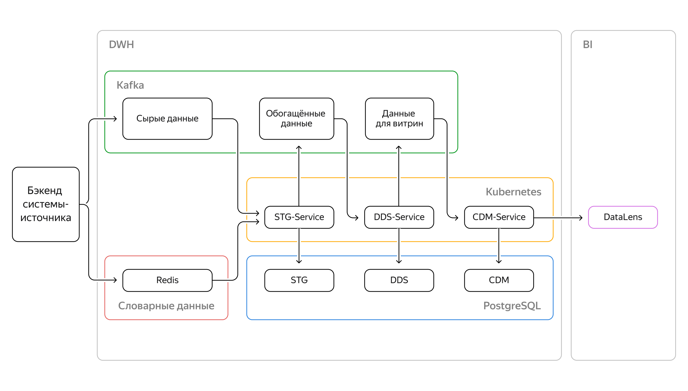
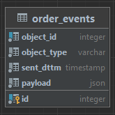
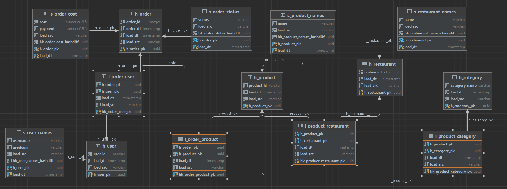
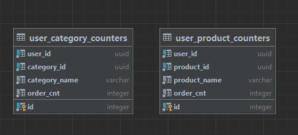

# Проект 9-го спринта

## Проект

В этом проекте нужно реализовать два оставшихся сервиса, которые заполняют слои DDS и CDM, и визуализировать данные из витрины в дашборде.

Полная архитектура решения выглядит так:


## Требования.
### Бизнес-требования
- Architech планирует запустить тегирование пользователей в приложении на основе статистики по заказам. Например, пользователь заказал 10 раз пиццу — присваиваем ему тег «Любитель пиццы».
- Все расчёты ведём только по закрытым заказам со статусом CLOSED
- В каждом заказе есть категория. Для этих категорий заведём счётчики с конкретными порогами. При превышении порога будем назначать гостю тег.

### Функциональные требования
- Формат данных будет JSON, структуру зафиксировали.

### Слои нужные в хранилище, чтобы решить задачу заказчика
- Staging-слой (STG)
- Detail Data Store (DDS) слой детализированных данных важен, потому что информацию надо собрать в удобном для управления виде. Модель данных: Data Vault.
- Common Data Marts (CDM). В CDM нужны две витрины. Первая витрина — счётчик заказов по блюдам; вторая — счётчик заказов по категориям товаров.

### Нефункциональные требования
- Информация по заказам — это потоковые данные, которые будут передаваться через брокер сообщений. Нагрузка на систему заказов — 5 заказов в минуту. С одной стороны, немного. С другой — 7200 заказов в сутки. И на старте загрузят историю за неделю, т. е. почти 50 000 заказов сразу.
- Надо обеспечить идемпотентность обработки сообщений из брокера.
- Суммарный бюджет на весь проект не должен превышать 5000 рублей в месяц.
- Используем технологии, которые позволят легко масштабировать сервис в будущем.
- Используемые технологии будут универсальными, а не уникальными, которые есть только у одного облачного провайдера. Нужно оставить возможность переходить из одного облака в другое.
- В DWH данные будут передаваться через Kafka.
- Полученные через Kafka данные будем хранить в PostgreSQL.
- В сообщениях поле id, необходимо будет перевести в имена. Например, блюда, рестораны, пользователи. Для этого понадобится Redis.
- Обрабатывать поток нужно будет написав сервисы на Python и развернув их в Kubernetes.
- Три сервиса на слой. Каждый сервис будет читать поток данных из Kafka и формировать свой слой данных. Сервисы так и назовём: STG-Service, DDS-Service и CDM-Service.
- Сделать дашборды на основе данных из DWH. Для визуализаций использовать DataLens.

## ER диаграммы DWH

### STG


### DDS


### CDM


##  Сервис DDS

### Логика работы сервиса
- Задача этого сервиса — заполнять данными детальный слой DWH в Postgres и отдать сообщение следующему сервису. 
- В качестве фреймворка для микросервиса используем Flask.
- Запуск цикла обработки сообщений в бэкграунде будет осуществляться при старте Flask.
- Процесс обработки будет осуществляться по расписанию библиотекой apscheduler каждые 25 секунд.
- Процесс получает обогащённые сообщения(заказы) из первого сервиса микробатчами(по умолчанию до 100 сообщений за раз).
- Консьюмер получает сообщения из топика stg-service-orders и в формате:
```
  { 	"object_id": 322519,
  	"object_type": "order",
  	"payload": {
		"id": 322519,
		"date": "2022-11-19 16:06:36",
  		"cost": 300,
  		"payment": 300,
  		"status": "CLOSED",
		"restaurant": {	"id": "626a81cfefa404208fe9abae", "name": "Кофейня №1" },
		"user": { "id": "626a81ce9a8cd1920641e296", "name": "Котова Ольга Вениаминовна"	},
	  	"products": [ {
	  		"id": "6276e8cd0cf48b4cded00878",
		  	"price": 180,
		  	"quantity": 1,
		  	"name": "РОЛЛ С ТОФУ И ВЯЛЕНЫМИ ТОМАТАМИ",
		  	"category": "Выпечка"
		  	},
		  	...
	 	]
  }}
```
- На основе входного сообщения формируются данные и загружаются в Хабы, а затем Линки и Сателлиты.
- h_*_pk генерится на основе id объекта хаба (SHA-1).
- hk_*_hashdiff — хэш-ключ, суррогатный ключ в таблице в формате UUID. Служит для определения уникальности загруженной строки. Рассчитывается на основе всех данных в строке.
- При повторной вставке объекта хаба (object_id) проигнорировать skip-if-exists.
- Повторной вставки сателитта не может быть, так как load_ds(=date.now).
- Конфликтов со вставкой линков не должно быть, так как всякий раз генерируется новый первичный ключ.
- Каждое выходное сообщение - список продуктов и их количество в заказе пользователя, а также список категорий и их количество.
- В процессе работы формируется выходное сообщение, в формате:
```
{
	"user_id": "626a81ce9a8cd1920641e296",
	"categories": {
		"4376e8cd0cf48b4cded11234": 
			{
				"category_name": "Выпечка",
				"order_cnt": 2 
			},
	},
	"products": {
		"6276e8cd0cf48b4cded00878":
			{
				"product_name": "РОЛЛ С ТОФУ И ВЯЛЕНЫМИ ТОМАТАМИ",
				"order_cnt": 23
			},
	}	
}
```

##  Сервис CDM

### Логика работы сервиса
- Процесс получает сообщения от сервиса DDS - список продуктов и категорий продуктов в заказе пользователя.
- В соответствии со схемой формируются экземпляры моделей таблиц, и отправляются в слой CDM на загрузке.
- При загрузке конфликтные записи обновляются новыми данными.


### Как работать с репозиторием
1. В вашем GitHub-аккаунте автоматически создастся репозиторий `de-project-sprint-9` после того, как вы привяжете свой GitHub-аккаунт на Платформе.
2. Скопируйте репозиторий на свой компьютер. В качестве пароля укажите ваш `Access Token`, который нужно получить на странице [Personal Access Tokens](https://github.com/settings/tokens)):
	* `git clone https://github.com/{{ username }}/de-project-sprint-9.git`
3. Перейдите в директорию с проектом: 
	* `cd de-project-sprint-9`
4. Выполните проект и сохраните получившийся код в локальном репозитории:
	* `git add .`
	* `git commit -m 'my best commit'`
5. Обновите репозиторий в вашем GitHub-аккаунте:
	* `git push origin main`
